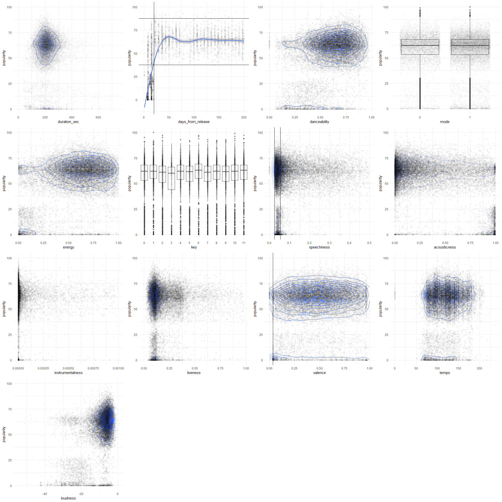
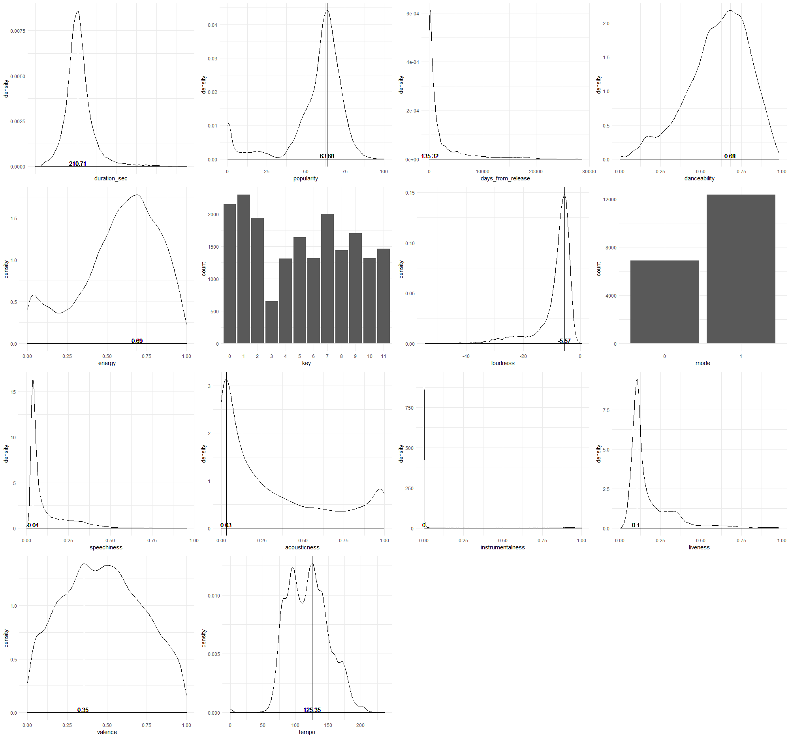
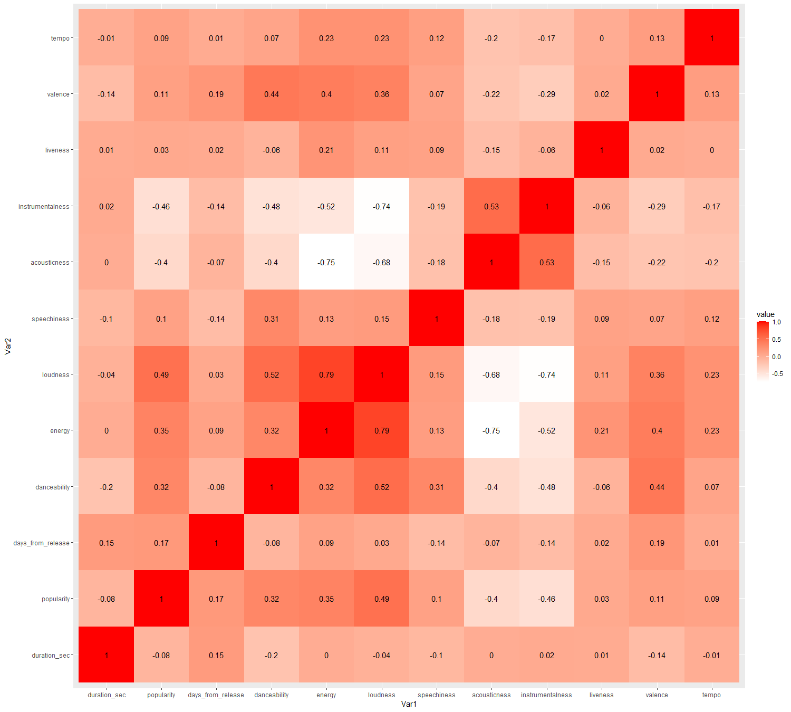
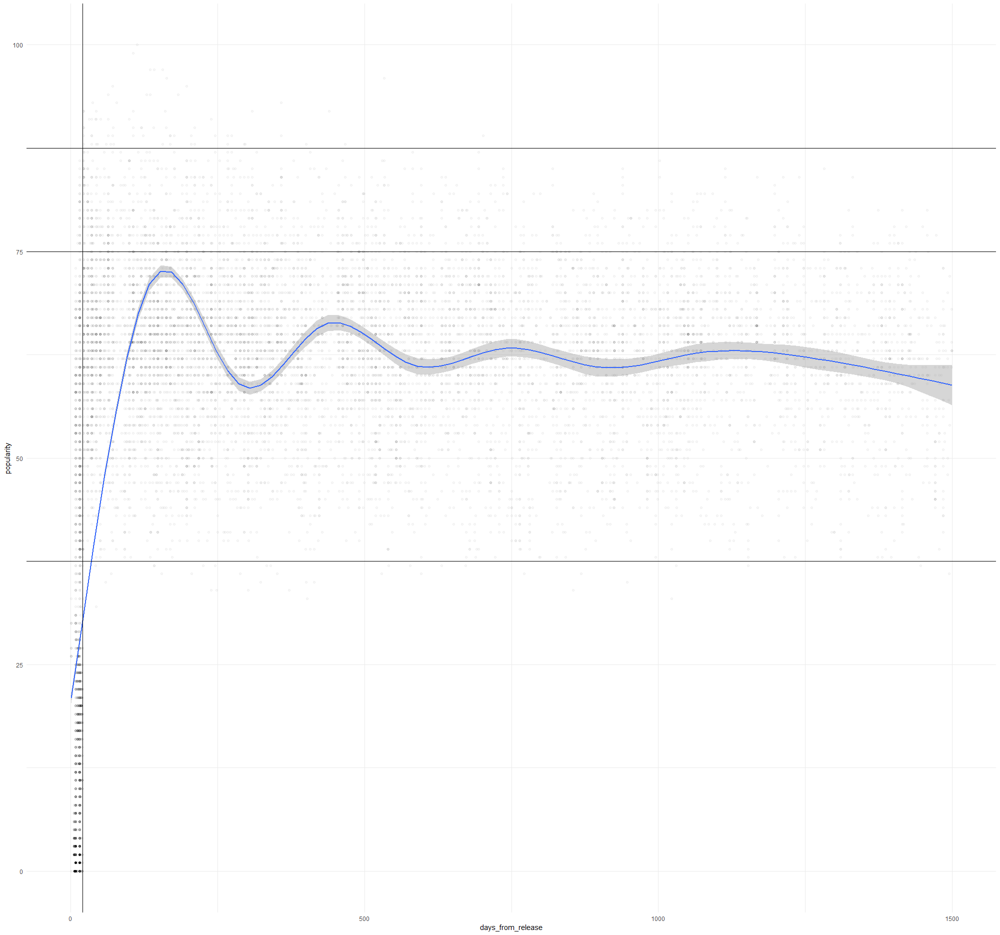

# Can you predict popularity of a song by its audio features?

Over 40,000 new songs are added to Spotify every day; some of them are meant to become instant hits and work their way into all-time classics, and others&#39; fate is to end on the landfill of forgotten songs. But what makes a popular song? If we could answer this question, music labels would get the power of choosing which songs to promote and what artists are guaranteed to succeed in increasing their profits dramatically. Moreover, artists would know which audience likes their art more and target those regions.

Over 40,000 new songs appear on Spotify daily. While some are become instant hints and join ranks of all-time classics others never appear in search. So, what constitutes a popular song? An answer to this question would give music labels a crystal ball helping them pick artists and songs to promote.

In this work, I focused on the search data from Spotify&#39;s API. To begin, the data was collected through Spotify&#39;s API. Second, the data was cleaned and prepared. Third, an explaratory analysis was conducted in search of parameters connected to popularity. Fourth, parameter heat map was created. Fifth, I converted problem to classification by dividing popularity into 4 classes of new/unpopular, popular, very popular and hits. The data set was imbalanced, with 80% of all observation laying in region 2 &quot;popular.&quot; No technique led to reasonable improvement of the model&#39;s predictive power.

In conclusion, predicting popularity of a song by its audio features is an impossible task as popularity depends on many qualitative aspects outside available data. Nonetheless, the data showed that song has 15 days to become popular before algorithm stops showing it.

The data is available on Kaggle through the link bellow. I encourage the reader to use data set to explore new music genres!

Link to Kaggle
[https://www.kaggle.com/nikitatkachenko/19332-spotify-songs](https://www.kaggle.com/nikitatkachenko/19332-spotify-songs)

Data collection can be accessed from [datasource.R](source.R) and analysis from [source.R](source.R)

### Popularity and features
There are number of observastions that can be made from the dataset. First, duration of songs clusters around 3.5 minutes and most popular songs follow this distribtuion closely. Days from release is pherhaps the most interesting graph. Song has only 15 days to become popular. If it fails to break 37.5 hurdle the algorith will not show it in its search. Other graphs show general distribution of the songs and might provide some evidence on popularity of particular genre.


### Distributions of differenent features
Collection of distribution of different features. The most interesting part here is the domination of songs written in major over songs in minor.


### Correlation heatmap
Examines correlations between different variables. One notable interaction would be level of loudness and other levels. Levels of loundness might be connected to specific genres.


### Classification problem
It would be impossible to predict popularity based on the set of features. To simplify the challenge, the problem was converted in to classification. We can notice 3 significant breakes. At 37.5 is the lower limit everything below that level will not be picked up by the algorithm and second is around 75, everything above 75 can be considered popular also there is a break around 87.5, above which new popular songs lay. The division would be unpopular/new, popular, hits, super hits.


**Confusion Matrix and Statistics**
It might appear that the algorith does a good job at predicting the popularity. In fact, it puts songs younger than 15 days into first basket and puts other songs in popular segment, largest of all the segments. I was unable to find a method to effectively address the data imbalance.
```text
          Reference
Prediction    2    1    3    4
         2 3107   22  280   12
         1   36  372    0    0
         3   11    0    5    0
         4    1    0    2    2

Overall Statistics
                                          
               Accuracy : 0.9055          
                 95% CI : (0.8958, 0.9145)
    No Information Rate : 0.8195          
    P-Value [Acc > NIR] : < 2.2e-16       
                                          
                  Kappa : 0.6373          
                                          
 Mcnemar's Test P-Value : NA              

Statistics by Class:

                     Class: 2 Class: 1 Class: 3  Class: 4
Sensitivity            0.9848  0.94416 0.017422 0.1428571
Specificity            0.5482  0.98958 0.996913 0.9992179
Pos Pred Value         0.9082  0.91176 0.312500 0.4000000
Neg Pred Value         0.8881  0.99361 0.926448 0.9968791
Prevalence             0.8195  0.10234 0.074545 0.0036364
Detection Rate         0.8070  0.09662 0.001299 0.0005195
Detection Prevalence   0.8886  0.10597 0.004156 0.0012987
Balanced Accuracy      0.7665  0.96687 0.507167 0.5710375
```
